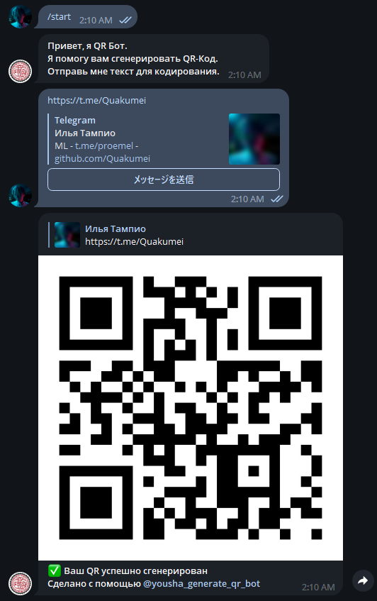
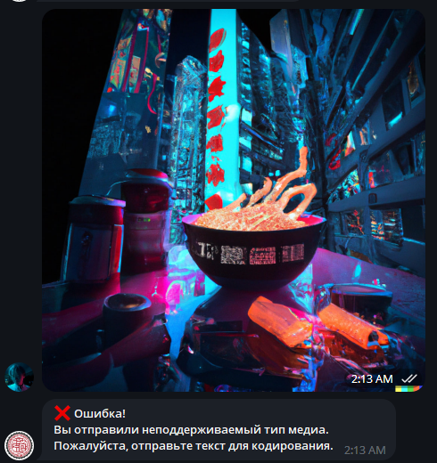
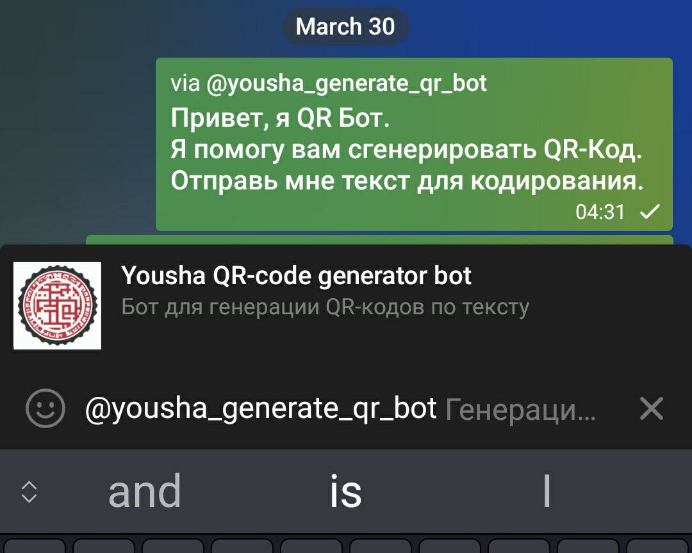

#  [@yousha_generate_qr_bot](https://t.me/yousha_generate_qr_bot) - Телеграм Бот

<!-- Center image -->
<p align="center">
  

## Функционал
- Телеграм бот для генерации QR-кода.
- Бот может сгенерировать QR-код для ссылок и текста.
- Подключена библиотека `'qrcode'`.
- У бота две команды: `/start` , `/help`
- Бот сейчас работает! --> [@yousha_generate_qr_bot](https://t.me/yousha_generate_qr_bot)

Обновления:
- *У бота имеется обработка ошибок.*
- *Бот контейниризован*
- *Можно ссылаться на бота в любом чате*
- *CI и make lint*
- *make run*

---

## Запуск проекта

```bash
pip3 install -r requirements.txt
echo "TOKEN='ТОКЕН:БОТА'" > src/config.py
make run
```

## Скриншоты

<!-- Use fixed width for screenshots -->






## Связь с автором

[@Quakumei](t.me/Quakumei) - Telegram
